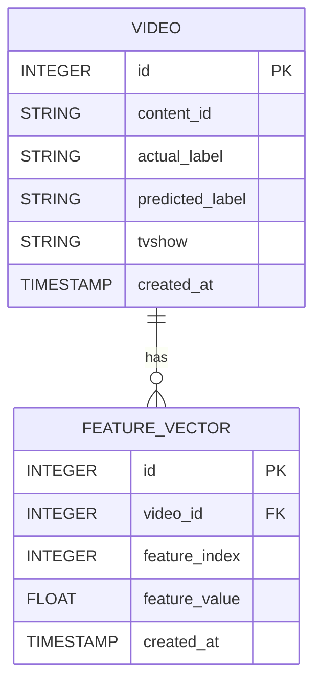

## Video Topics API

This project defines a back-end application composing a FastAPI server written in Python and a PostGres database. Everything is condensed together using Docker.

This application was developed using a MacOS, but as we've used Docker to isolate the containers,
it should be reproducible in any machine.

### Key Dependencies

- Python 3.12
- Docker

### What does this application do ?

Basically, inside the docker container, the application will:

- Start the PostGres database;
- Run a migrations script to automatically create the tables/schema;
- Start the web server;
- Load the batch data using a POST endpoint.

### How is the DB structured ?
The schema consists of two main tables: `videos` and `feature_vectors`. The `videos` table stores information about videos, while the `feature_vectors` table contains the associated feature vectors for each video. 

### Table Definitions

#### `videos`

The `videos` table stores the following columns:
- `id`: Primary key, auto-incremented integer.
- `content_id`: Unique identifier for the video, cannot be null.
- `actual_label`: Actual label of the video, cannot be null.
- `predicted_label`: Predicted label of the video, cannot be null.
- `tvshow`: The TV show to which the video belongs, cannot be null.
- `created_at`: Timestamp of when the record was created, defaults to the current time.

The `videos` table has a one-to-many relationship with the `feature_vectors` table. This relationship is established through the `feature_vectors` attribute, which references the `FeatureVector` class.

#### `feature_vectors`

The `feature_vectors` table stores the following columns:
- `id`: Primary key, auto-incremented integer.
- `video_id`: Foreign key that references the `id` in the `videos` table, cannot be null.
- `feature_index`: Integer used to maintain the order of feature values, cannot be null.
- `feature_value`: The value of the feature vector, a floating-point number, cannot be null.
- `created_at`: Timestamp of when the record was created, defaults to the current time.

The `feature_vectors` table has a many-to-one relationship with the `videos` table, represented by the `video` attribute.

### Relationship Diagram

The schema features a one-to-many relationship between `videos` and `feature_vectors`. Each video can have multiple feature vectors associated with it.

Here is a Mermaid diagram illustrating this relationship:



**Video Table**: Each entry in the videos table represents a video with its associated metadata.
FeatureVector Table: Each entry in the feature_vectors table represents a feature vector associated with a specific video.
The one-to-many relationship means that a single video can have multiple feature vectors, but each feature vector is associated with only one video.

This schema setup allows for efficient querying and management of video-related data and their associated feature vectors.

### How does this application works ?

#### Building and going up
Making sure you have the dependencies installed, you will need to run:

```shell
# Build
docker-compose build # Depending on your machine, this will take a while to run due to gcc installation for the postgres db

# Run the docker compose
docker-compose up
```

- The first time you run the `build` command above it will proably take a while, specially due to some basic installations such as `gcc` in the alpine OS.
- The first time you run the `up` command will probably take a while as well due to the `db` and `pgadmin` images that won't be cached on your machine.

#### Instructions to use it
As this applicaton is using FastAPI, you will have an autogenerated swagger exposed in the following URL:

`http://localhost:8004/docs`

This application currently exposes four routes:

`POST - /ping` --> Basically a health check endpoint. Could be used for metrics and alerting in case our system goes down for any reason.
`POST - /videos` --> Creates a single video. An example on how to use it with CURL is shown below:

```shell
curl -X 'POST' \
  'http://127.0.0.1:8004/videos' \
  -H 'Content-Type: application/json' \
  -d '{
    "content_id": "<my_content_id>",
    "actual_label": "People & Family & Pets",
    "predicted_label": "Events and attractions",
    "feature_vector": [
        <comma_separated_feature_vector_elements>
    ],
    "tvshow": "tv0k"
  }'
```

`POST - /videos/batch/csv` --> Creates multiple video entries in db using a CSV. 
```shell
curl -X 'POST' \
  'http://localhost:8000/videos/batch/csv' \
  -H 'accept: application/json' \
  -H 'Content-Type: multipart/form-data' \
  -F 'file=@/<my-path>/data.csv;type=text/csv'
```

`GET - /videos/<content_id>` --> This endpoint allows us to retrieve an entire video topic stored using a GET endpoint. This may be useful to display individual records.

#### Inspecting the database
This application also uses the `pgadmin` container to allow us to query the PostGres database. To do so, with everything up, go to the following URL:

`http://localhost:8888`

You will need to login using the following credentails defined in the `.env` file:
-  `PGADMIN_EMAIL` and `PGADMIN_PASSWORD`.

After that, you will need to connect the database, using the following parameters from the `.env` file:

- username: `POSTGRES_USER`,
- password: `POSTGRES_PASSWORD`
- host: `PGADMIN_HOST`

Then, you can inspect the db using [pgadmin](https://www.pgadmin.org/docs/pgadmin4/development/getting_started.html)

### Data Analysis examples

#### Performance
We could check the performance of our model with:
- [**Confusion Matrix**](https://en.wikipedia.org/wiki/Confusion_matrix): Analyze the performance of our classification model by creating a confusion matrix. This will help you see how many true positives, true negatives, false positives, and false negatives your model is generating.
- We could compute metrics such as: [Accuracy, precision, recall and F1-score](https://www.labelf.ai/blog/what-is-accuracy-precision-recall-and-f1-score).

We could expose those elements in endpoints such as:
- GET `videos/analysis/confusion-matrix`
- GET `videos/analysis/performance-metrics`

#### Feature Analysis
We could also, for example, calculate the feature importance of every vectorized element in a piece of video. Every record in the feature vector (256 elements) represents a feature for us. This analysis would help us to understand which features contribute most to the predictions made by the machine learning model. This could be done using Tree-based models, for example, Random Forests, and Gradient Boosting Machines (e.g., XGBoost, LightGBM), etc. This could also be exposed into an endpoint:

- GET `videos/analysis/feature-importance`


### Improvement points for this piece of software

- Tests must be written to cover unitary functions and also the integration behaviour of each API.
- The size of the Dockerimage could be reduced, as well as the time to build the image.
- The batch is being inserted but we are not validating the quality of the batch CSV file. This could also be improved to validate each field of it.
- The batch does not uses [idempotency](https://en.wikipedia.org/wiki/Idempotence) concepts. It will either insert everything or fail. In the case where any of the content_id's already exists, the entire batch operation would fail. This is not ideal and could also be improved.
- We are not validating the `content_id` formatting, we consider every string as a valid `content_id`. This could be improved given that we most probably have a specific formatting for the id. The same applies, for example, to the `feature_vector`, that will most probably only have 256 entries each one. This could also be validated to improve data ingestion quality.
- We could have used a linter such as `black` and `flake8` to guarantee the quality of the codebase.
- We could have used something like `poetry` to manage dependencies. This is a simple project that currently using `pip` won't engender any issues, but if the project evolves, managing library dependencies among each other may become a very time consuming task.
- The `migrations.py` is something very simple currently, and it doesn't verify if the table already exists in PostGres. It could be improved to also use a lib such as `alembic` to handle database migrations and to evolve our database structure.
- Talking about database performance, it could also be improved for batch insertion. Currently, we are using a transaction alike way of inserting. If we have a lot of parallelism and different workers performing inserts in a database this can cause performance/locking issues that could be improved.